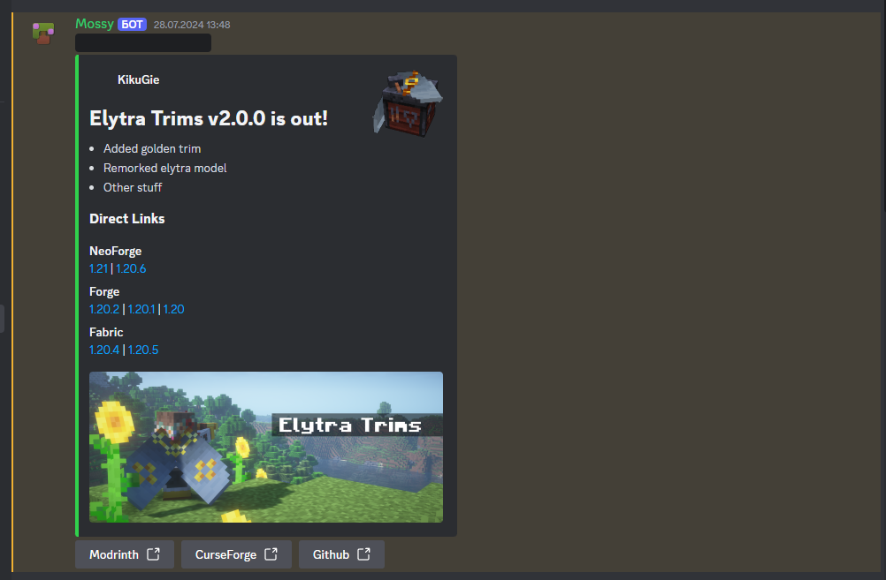
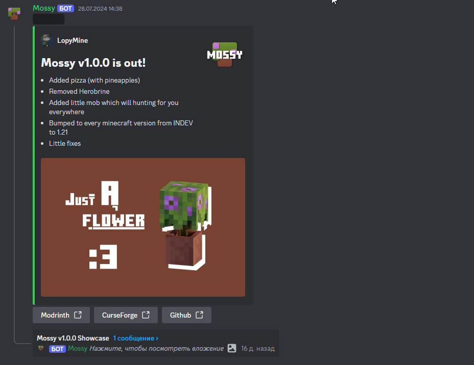

[](https://discord.gg/NZzxdkrV4s) [![Support Link-Banner [Boosty]](https://cdn.modrinth.com/data/cached_images/dce91fef079649dee277c52a998fc068e745e99e.png)](https://boosty.to/lopymine/donate)

# Discord Mod Announcer

Discord Mod Announcer — Simple Gradle plugin for easily announcing new mods or their updates in your Discord server!

# How To Use

First, you need to add this plugin to your Gradle project:

```gradle
// In build.gradle
plugins {
    id "net.lopymine.discord-mod-announcer" version "1.0.0"
}

// In settings.gradle
pluginManagement {
    repositories {
        // I don't have any repositories or money for it
        // because you need to fork this project and publish to local maven
        mavenLocal()
    }
}
```

Here is a basic example of this plugin configuration:

```gradle
announceToDiscord {
    // If VERSIONED, "minecraftVersion" and "loader" is required
    // With it plugin will search latest mod version for specified MC version with specified loader
    // from specified platform and then add link for this version to the announce message.
    // If "modrinthLink", "curseForgeLink" or "githubLink" are present, it will be added also
    
    // If just BUTTONS, plugin will just add buttons with links to the announce message, if they are present
    linksFormat = VERSIONED // Optional, BUTTONS by default
    
    // Plaftform from where plugin will search latest mod version
    // Can be MODRINTH, CURSEFORGE
    // MODRINTH by default
    priorityPlatform = CURSEFORGE
    
    minecraftVersion = "1.20.1" // Required if "linksFormat" is VERSIONED
    loader = "fabric" // Required if "linksFormat" is VERSIONED
    
    modrinthModId = "collision-fix" // Required if "linksFormat" is VERSIONED
    
    curseForgeProjectId = 946375 // Required if "linksFormat" is VERSIONED
    curseForgeAPIToken = providers.environmentVariable("CURSEFORGE_API_KEY") // Required if "linksFormat" is VERSIONED

    // Can be ENABLE, DISABLE, TEST
    // ENABLE by default
    // If ENABLE, message will be sent to "announcementChannelId"
    // If TEST, message will be sent to "testAnnouncementChannelId" 
    // if DISABLE, message won't be sent
    announceMode = TEST // Optional
    
    token = providers.environmentVariable("DISCORD_BOT_TOKEN") // Required
    icon = project.rootProject.file("icon.png") // Optional
    
    title = "My Cool Mod v2.0.0 is out!" // Required
    showcaseThreadTitle = "Showcase My Cool Mod v2.0.0" // Optional
    changelog = "- Changelog line one \n- Changelog line two \n- Changelog line three" // Required
    
    modrinthLink = "https://youtu.be/dQw4w9WgXcQ?si=YuNYqbxc3xXANfKl" // Optional
    curseForgeLink = "https://youtu.be/hvL1339luv0?si=m9v6lHiIz7aly3uJ" // Optional
    githubLink = "https://youtu.be/EpX1_YJPGAY?si=MfyB_wTVIv6I3NcZ" // Optional
    
    uploaderId = "616939110598443008" // Optional
    announcementChannelId = "1102941223003631698" // Required
    testAnnouncementChannelId = "1266007822173470730" // Required for tests
    pingRoles = ["Developer", "Mossy"] // Optional

    // Optional
    showcaseImages = [project.rootProject.file("showcase.png"),project.rootProject.file("showcase2.png"), project.rootProject.file("showcase2.png")]
}
```

Then you can use task "announceToDiscord" in group "announce" to announce your mod in a specific channel

<details>
<summary>Showcase with VERSIONED linksFormat</summary>
<br>

</details>

<details>
<summary>Showcase with BUTTONS linksFormat</summary>
<br>

</details>